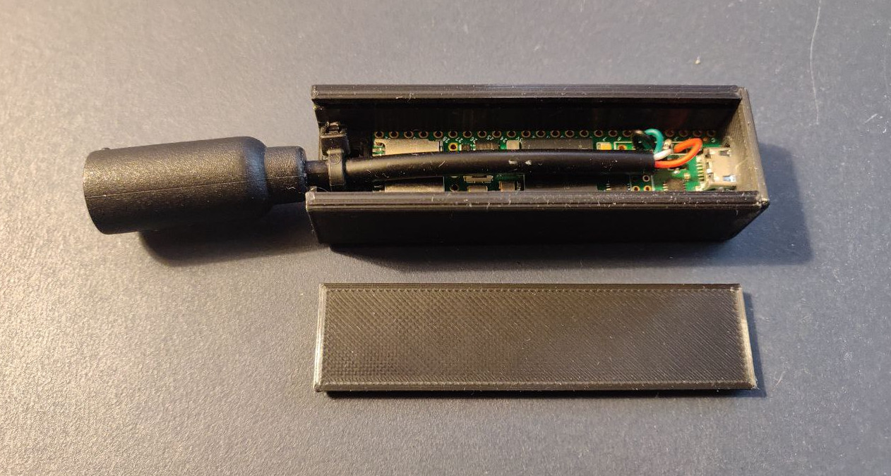
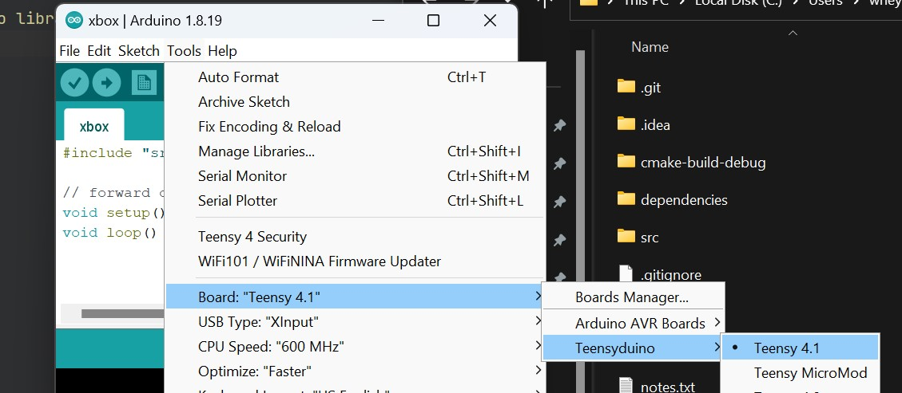
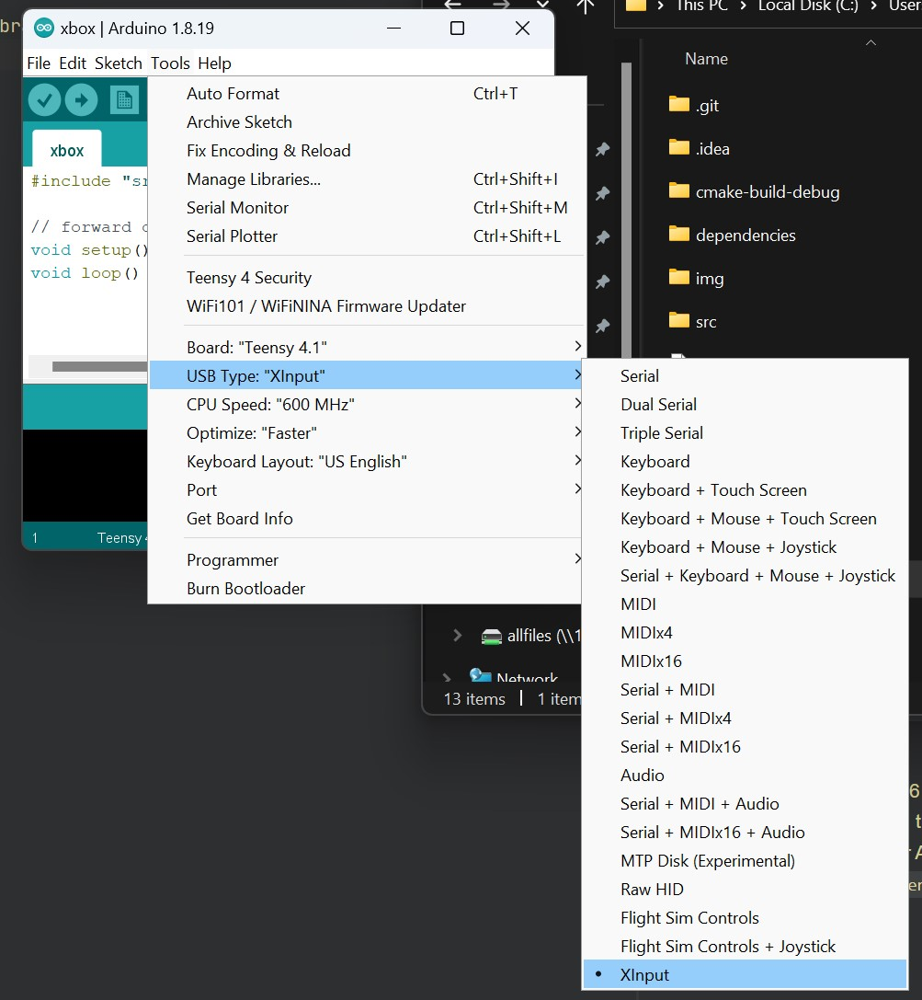

# Xbox controller converter
This repo contains firmware to produce a hardware converter which allows an original xbox controller to present itself as an xbox 360 controller for use with pc games.

Case is 3d printed, cad file is `case.FCStd` (freecad format). Glue the front on with epoxy to stop it sliding.
The cable is a cut open xbox controller cable, soldered to the USB host pins on a teensy 4.1, and held down with a cable tie. You can get a sacrificial cable on ebay! Don't destroy an original. You might be able to get this working on some other hardware, but I haven't tried. There's a writeup about this project at http://wheybags.com/blog/xbox.html

# How to build
This is kind of an awful procedure, but in my defence, it's not really my fault. Most of it is just the Arduino ecosystem being a bit unsatisfactory. I used specific versions of Arduino and teensyduino here, it's patches on patches. If you want to use a newer version of anything you're on your own. Installers for the specific versions we need are available in the `dependencies/` folder

- Install Arduino 1.8.19
- Install teensyduino 1.56
- Now we need to install the patches to teensyduino that let us emulate a 360 controller. Copy the `dependencies/ArduinoXInput_Teensy/teensy` folder on top of the `teensy` folder in your Arduino IDE install directory (eg `C:\Program Files (x86)\Arduino\hardware\teensy`)
- Next copy the `dependencies/ArduinoXInput` folder into your Arduino libraries folder (eg `C:\Program Files (x86)\Arduino\libraries\ArduinoXInput`)
- Now open the `xbox.ino` file in the Arduino IDE
- Select the Teensy 4.1 board from the Tools menu

- Set the USB type to XInput

- Build the project in arduino IDE. Hopefully it works.
